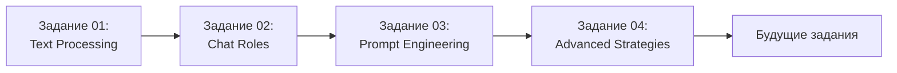

# Практические задания

Эта директория содержит практические задания для проверки и закрепления знаний по различным темам базы знаний.

## Структура заданий

Каждое задание имеет номер и описательное название на английском языке:
- `01_OpenAI_API_Text_Processing_Exercise.md` - базовая работа с OpenAI API (редактирование, резюмирование, генерация текста)
- `02_Chat_Roles_and_Conversations_Exercise.md` - система ролей и многоэтапные диалоги
- `03_Prompt_Engineering_Exercise.md` - лучшие практики создания эффективных промптов
- `04_Advanced_Prompt_Engineering_Strategies_Exercise.md` - продвинутые стратегии (Shot Prompting, Chain-of-Thought, Self-Consistency)
- Следующие задания добавляются по мере роста базы знаний

### Директории для решений и проверок

**`Solves/`** - решения заданий:
- Формат: `##_Topic_Name_Solve.ipynb`
- Содержит: код решений в формате Jupyter notebook с выполненными ячейками

**`Reviews/`** - проверки решений:
- Формат: `##_Topic_Name_Review.md`
- Содержит: детальные разборы с оценками, анализом ошибок и рекомендациями

## Формат заданий

Каждое задание включает:
- 📋 **Цель задания** - что вы научитесь делать
- 📚 **Связанные материалы** - ссылки на теоретические заметки
- ⚙️ **Предварительные требования** - что нужно установить/настроить
- 📝 **Пошаговые задачи** - четкие инструкции для выполнения
- ✅ **Ожидаемые результаты** - как должен выглядеть правильный ответ
- 💻 **Шаблоны кода** - заготовки для ускорения работы
- 📊 **Критерии оценки** - как оценить качество выполнения
- 💡 **Рекомендации** - советы по выполнению

## Как использовать

1. Выберите задание, соответствующее изученному материалу
2. Прочитайте связанные теоретические заметки
3. Подготовьте окружение (установите библиотеки, создайте файлы)
4. Выполняйте задачи последовательно
5. Сравните ваши результаты с ожидаемыми
6. Экспериментируйте и анализируйте результаты

## Список доступных заданий

| № | Название | Тема | Сложность | Время | Решение | Ревью |
|---|----------|------|-----------|-------|---------|-------|
| 01 | [Text Processing with OpenAI API](01_OpenAI_API_Text_Processing_Exercise.md) | OpenAI API | Начальный | ~75 мин | [✅](Solves/01_OpenAI_API_Text_Processing_Solve.ipynb) | [✅](Reviews/01_OpenAI_API_Text_Processing_Review.md) |
| 02 | [Chat Roles and Conversations](02_Chat_Roles_and_Conversations_Exercise.md) | Роли в чатах | Начальный | ~80 мин | [✅](Solves/02_Chat_Roles_and_Conversations_Solve.ipynb) | [✅](Reviews/02_Chat_Roles_and_Conversations_Review.md) |
| 03 | [Prompt Engineering Best Practices](03_Prompt_Engineering_Exercise.md) | Prompt Engineering | Начальный | ~90 мин | [✅](Solves/03_Prompt_Engineering_Solves.ipynb) | [✅](Reviews/03_Prompt_Engineering_Review.md) |
| 04 | [Advanced Prompt Engineering Strategies](04_Advanced_Prompt_Engineering_Strategies_Exercise.md) | Advanced Prompt Engineering | Средний | ~120 мин | [✅](Solves/04_Advanced_Prompt_Engineering_Strategies_Solve.ipynb) | [✅](Reviews/04_Advanced_Prompt_Engineering_Strategies_Review.md) |

## Описание заданий

### 01. Text Processing with OpenAI API

**Что вы освоите:**
- Редактирование и трансформация текстов через API
- Резюмирование больших объемов информации
- Расчет и оптимизация стоимости запросов
- Управление параметром `temperature` для контроля креативности
- Zero-shot и Few-shot промптинг для классификации

**Предварительные требования:** Базовое понимание Python, установленные библиотеки `openai` и `python-dotenv`

**Связанные заметки:**
- [[OpenAI_API/Introduction_to_OpenAI_API|Введение в OpenAI API]]
- [[OpenAI_API/Working_with_OpenAI_API_in_Python|Работа с OpenAI API в Python]]
- [[Python_for_AI/Python_Decorators|Декораторы в Python]] - для понимания продвинутых паттернов
- [[Python_for_AI/Tenacity_Library_for_Retry_Logic|Библиотека Tenacity]] - для устойчивой работы с API

---

### 02. Chat Roles and Conversations

**Что вы освоите:**
- Управление поведением модели через системную роль
- Установку границ и ограничений для специализированных чат-ботов
- Few-shot prompting через синтетические диалоги user-assistant
- Создание многоэтапных диалогов с сохранением контекста
- Анализ и оптимизацию стоимости длинных разговоров

**Предварительные требования:** Выполненное задание №01, понимание базовых принципов работы с API

**Связанные заметки:**
- [[OpenAI_API/Chat_Roles_and_Multi_Turn_Conversations|Роли в чатах и многоэтапные диалоги]]
- [[OpenAI_API/Working_with_OpenAI_API_in_Python|Работа с OpenAI API в Python]]
- [[Python_for_AI/Tenacity_Library_for_Retry_Logic|Библиотека Tenacity]] - для обработки ошибок в production

---

### 03. Prompt Engineering Best Practices

**Что вы освоите:**
- Использование эффективных глаголов действия в промптах
- Создание детальных инструкций с учетом аудитории и контекста
- Структурирование промптов для получения форматированных ответов
- Генерацию таблиц, списков и пользовательских форматов
- Встраивание условной логики в промпты
- Итеративное улучшение промптов для достижения лучших результатов
- Применение разделителей и few-shot learning

**Предварительные требования:** Выполненные задания №01 и №02, понимание работы с OpenAI API

**Связанные заметки:**
- [[Prompt_Engineering/Prompt_Engineering_Best_Practices|Лучшие практики Prompt Engineering]]
- [[OpenAI_API/Working_with_OpenAI_API_in_Python|Работа с OpenAI API в Python]]
- [[Python_for_AI/Python_Decorators|Декораторы в Python]] - для создания переиспользуемых паттернов

---

### 04. Advanced Prompt Engineering Strategies

**Что вы освоите:**
- Shot Prompting: сравнение Zero-shot, One-shot и Few-shot подходов
- Few-shot через user-assistant диалоги для классификации
- Multi-Step Prompting для структурированного выполнения задач
- Chain-of-Thought (CoT) для получения пошаговых рассуждений модели
- Self-Consistency для повышения надежности через множественные решения
- Iterative Refinement - циклическое улучшение промптов
- Комбинирование техник (Multi-Step + CoT + Few-Shot) для сложных задач
- Построение production-ready классификаторов с высокой точностью

**Предварительные требования:** Выполненные задания №01-03, понимание базовых техник prompt engineering

**Связанные заметки:**
- [[Prompt_Engineering/Advanced_Prompt_Engineering_Strategies|Продвинутые стратегии Prompt Engineering]]
- [[Prompt_Engineering/Prompt_Engineering_Best_Practices|Лучшие практики Prompt Engineering]]
- [[OpenAI_API/Chat_Roles_and_Multi_Turn_Conversations|Роли в чатах и многоэтапные диалоги]]

## Рекомендуемый порядок выполнения

**Важно:** Задания построены с прогрессивным увеличением сложности. Рекомендуется выполнять их последовательно для лучшего усвоения материала.

---

*Задания регулярно обновляются и дополняются новыми по мере развития базы знаний*
